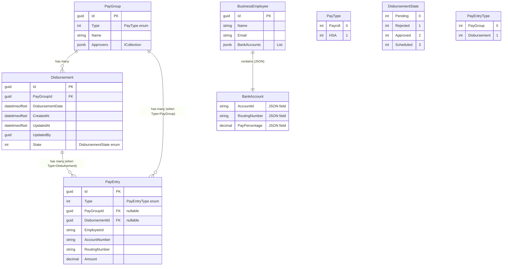

# Database Schema

This document describes the database schema for the Company Management API, excluding the Employee entity.

## Entity Relationship Diagram



## Entity Descriptions

### PayGroup
Represents a group of pay entries that can be processed together.
- **Id**: Primary key (GUID)
- **Type**: PayType enum (Payroll, HSA)
- **Name**: Human-readable name for the pay group
- **Approvers**: JSON array of approver identifiers

### Disbursement
Represents a disbursement of funds from a PayGroup.
- **Id**: Primary key (GUID)
- **PayGroupId**: Foreign key to PayGroup
- **DisbursementDate**: When the disbursement occurred/will occur
- **CreatedAt**: Audit field - when record was created
- **UpdatedAt**: Audit field - when record was last updated
- **UpdatedBy**: Audit field - who last updated the record
- **State**: DisbursementState enum (Pending, Rejected, Approved, Scheduled)

### PayEntry
Represents individual payment entries that belong to either a PayGroup or Disbursement (exclusive relationship).
- **Id**: Primary key (GUID)
- **Type**: PayEntryType enum determining parent relationship
- **PayGroupId**: Foreign key to PayGroup (nullable)
- **DisbursementId**: Foreign key to Disbursement (nullable)
- **EmployeeId**: Reference to employee
- **AccountNumber**: Bank account number
- **RoutingNumber**: Bank routing number
- **Amount**: Payment amount

**Important**: PayEntry uses a discriminated union pattern where it belongs to either a PayGroup OR a Disbursement, never both. This is enforced by:
- A Type discriminator field
- Database check constraint ensuring exclusivity
- Nullable foreign keys with only one populated based on Type

### BusinessEmployee
Represents business employees with their banking information.
- **Id**: Primary key (GUID)
- **Name**: Employee name  
- **Email**: Employee email address (unique)
- **BankAccounts**: JSON array of BankAccount objects
- **IsValid**: Computed property that validates PayPercentage totals equal 1.0

### BankAccount (JSON Object)
Stored as JSONB within BusinessEmployee, represents bank account details.
- **AccountId**: Bank account identifier
- **RoutingNumber**: Bank routing number  
- **PayPercentage**: Percentage of pay (must total 1.0 across all accounts)

## Key Relationships

1. **PayGroup → Disbursement** (1:many)
   - One PayGroup can have multiple Disbursements
   - Cascade delete: Deleting PayGroup removes all Disbursements

2. **PayGroup → PayEntry** (1:many, conditional)
   - One PayGroup can have multiple PayEntries
   - Only when PayEntry.Type = PayGroup
   - Cascade delete: Deleting PayGroup removes associated PayEntries

3. **Disbursement → PayEntry** (1:many, conditional)
   - One Disbursement can have multiple PayEntries
   - Only when PayEntry.Type = Disbursement
   - Cascade delete: Deleting Disbursement removes associated PayEntries

4. **BusinessEmployee contains BankAccount** (1:many, JSON)
   - BankAccounts stored as JSONB array
   - Business rule: PayPercentage values must sum to 1.0 (100%)

## Enums

### PayType
- **Payroll** (0): Regular payroll payments
- **HSA** (1): Health Savings Account contributions

### DisbursementState
- **Pending** (0): Awaiting processing
- **Rejected** (1): Rejected for processing
- **Approved** (2): Approved for disbursement
- **Scheduled** (3): Scheduled for future disbursement

### PayEntryType
- **PayGroup** (0): PayEntry belongs to a PayGroup
- **Disbursement** (1): PayEntry belongs to a Disbursement

## Database Indexes (Performance Optimized)

### PayEntry Table Indexes
- **ix_pay_entries_type**: Fast filtering by PayEntryType
- **ix_pay_entries_employee_id**: Employee-based queries
- **ix_pay_entries_pay_group_id**: PayGroup relationship queries
- **ix_pay_entries_disbursement_id**: Disbursement relationship queries

### Disbursement Table Indexes
- **ix_disbursements_state**: Filter by DisbursementState (Pending, Approved, etc.)
- **ix_disbursements_pay_group_id**: PayGroup relationship queries
- **ix_disbursements_disbursement_date**: Date-based filtering and ordering

### BusinessEmployee Table Indexes
- **ix_business_employees_email**: Unique constraint + fast email lookups

### Employee Table Indexes
- **ix_employees_department**: Department-based queries (existing)

## Database Constraints

1. **PayEntry Exclusivity**: Check constraint ensures PayEntry belongs to exactly one parent:
   ```sql
   (type = 0 AND pay_group_id IS NOT NULL AND disbursement_id IS NULL) OR 
   (type = 1 AND pay_group_id IS NULL AND disbursement_id IS NOT NULL)
   ```

2. **BusinessEmployee Email Uniqueness**: Unique constraint on email field

3. **BankAccount Percentages**: Application-level validation ensures PayPercentage values sum to 1.0

## Design Patterns Used

1. **Discriminated Union**: PayEntry uses Type field to determine parent relationship
2. **JSON Storage**: BankAccount details stored as JSONB for efficiency  
3. **Audit Fields**: CreatedAt, UpdatedAt, UpdatedBy for change tracking
4. **Cascade Deletes**: Maintaining referential integrity through EF Core relationships
5. **Performance Indexing**: Strategic indexes on commonly queried fields
6. **Pragmatic Simplicity**: Single collection pattern throughout entities

## Performance Optimizations

### Database Level
- **Strategic Indexing**: Indexes on commonly filtered and joined columns
- **JSONB Usage**: Efficient storage and querying for nested data structures
- **Check Constraints**: Database-level enforcement of business rules
- **Cascade Deletes**: Automatic cleanup of related records

### Application Level  
- **Snake Case Caching**: Cached string conversions prevent allocations during EF model building
- **EF Collection Management**: Let EF Core manage navigation property initialization
- **Simple Property Logic**: Removed caching complexity for predictable behavior
- **Consistent Collection Types**: Single `ICollection<T>` pattern throughout

### Developer Experience
- **Predictable Behavior**: No hidden caching or state management
- **Standard EF Patterns**: Familiar conventions for EF Core developers  
- **Clear Error Messages**: Validation provides actionable feedback
- **Simple APIs**: One way to work with collections, reducing confusion

## Architecture Decisions

### Performance vs Simplicity Trade-offs
- **Chose simplicity** for BusinessEmployee.IsValid over micro-optimizations
- **Chose consistency** with single collection pattern over multiple accessor types
- **Chose database indexes** over application-level caching for query performance
- **Chose JSONB** over normalized tables for tightly coupled data (BankAccounts)

### Pragmatic Design Principles
- **Ship-ready over perfect**: Code that developers can use successfully today
- **Convention over configuration**: Follow EF Core and C# patterns
- **Fail fast and clearly**: Validation errors provide specific guidance
- **Progressive disclosure**: Simple cases are simple, complex cases are possible